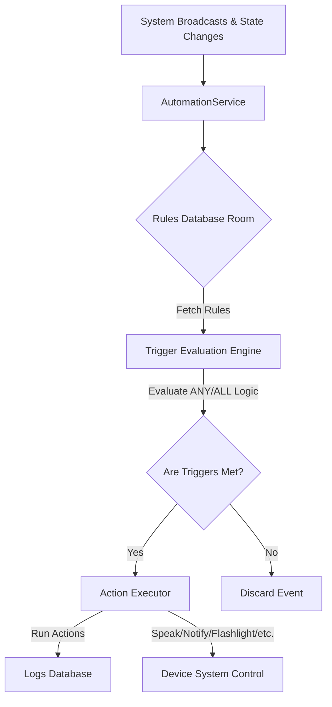

# 🌌 Zenith: Premium Android Automation Engine

Zenith is a state-of-the-art, premium Android automation application designed with a beautiful **Glassmorphic UI**. It empowers users to create highly customized automation rules based on environmental triggers and execute powerful, context-aware actions seamlessly in the background.

---

## 🌟 Key Features

### 1. 🔀 Advanced Multi-Trigger Engine (AND/OR Logic)
Zenith replaces traditional, linear "single-trigger + conditions" logic with a robust, nested **Multi-Trigger Engine**:
* **ANY (OR)**: The rule fires immediately if *any* of the defined triggers are activated.
* **ALL (AND)**: The rule fires only when *all* defined triggers are concurrently active. One trigger acts as a catalyst event, prompting the background engine to query active system states for all other criteria.
* **Sub-Conditions & Dynamic States**: Triggers can have sub-conditions/states (e.g., *Bluetooth State Changed* has sub-states `On` or `Off`; *Wi-Fi State* has `Connected` or `Disconnected`). When selected, Zenith beautifully prompts the user to select the specific active state.

### 2. 🎨 Premium Glassmorphic UI & Themes
Zenith provides a jaw-dropping premium visual experience. Cards are modern, translucent panels with thin frosted strokes, glowing drop shadows, and vibrant backgrounds. Switch between four stunning visual experiences via the settings page:
* **Glass Theme (Default)**: Modern frosted-glass aesthetic with soft cyan/indigo glows.
* **AMOLED Theme**: Deep pitch-black background preserving glassmorphic panels. Excellent for battery saving.
* **Ocean Theme**: Relaxing deep blue sea hues with bright cyan accents.
* **Sunset Theme**: Warm, vibrant orange and purple gradient hues.

### 3. ⚙️ Smart Deletion Preferences
Tailor your interactive experience in Saved Rules and Execution Logs:
* **Swipe-to-Delete**: Use fluid left-swipe gestures to discard items dynamically (powered by `ItemTouchHelper`).
* **Button-Delete**: Prefer traditional controls? Toggle the setting to display dedicated delete buttons directly on cards.


---

## 🚀 Supported Triggers

Zenith organizes triggers into **6 distinct categories** to capture any physical or system event:

### 1. 🌐 Connectivity & Network
* **Wi-Fi Connected / Disconnected**: Fires on Wi-Fi state change (supports sub-states: `Connected`, `Disconnected`).
* **Bluetooth Device**: Fires when connecting/disconnecting from a specific device (supports sub-states: `Connected`, `Disconnected`).
* **Bluetooth State Changed**: Fires when Bluetooth is turned on or off (supports sub-states: `On`, `Off`).
* **Airplane Mode Changed**: Fires when toggled (supports sub-states: `On`, `Off`).
* **Mobile Data State Changed**: Fires when mobile data is toggled (supports sub-states: `On`, `Off`).
* **NFC Tag Detected**: Fires when tapping an NFC tag against your phone.
* **Cell Tower Connected**: Fires when connecting or disconnecting from a specific cell tower.

### 2. 💬 Communication & Notifications
* **SMS Received**: Fires on incoming SMS. Filter by phone number or keyword.
* **SMS Sent**: Fires after you send an SMS.
* **Call State**: Fires on incoming, outgoing, or missed calls.
* **Notification Received**: Fires when a specific app posts a new notification.

### 3. 🔌 Device State & Sensors
* **Battery Level**: Triggers when battery level matches, falls below, or exceeds specific levels.
* **Power Connected / Disconnected**: Triggers when charger is plugged or unplugged (supports sub-states: `Connected`, `Disconnected`).
* **Screen On / Off / Unlocked**: Triggers on screen state changes (supports sub-states: `Screen On`, `Screen Off`, `User Present/Unlocked`).
* **Device Shake**: Fires when shaking the device with set sensitivity.
* **Device Orientation**: Fires on portrait/landscape rotation.
* **Headset Plugged**: Fires on wired headset connection (supports sub-states: `Connected`, `Disconnected`).
* **Docked / Undocked**: Fires on dock connection (supports sub-states: `Docked`, `Undocked`).
* **USB Connected**: Fires when a USB cable is plugged/unplugged (supports sub-states: `Connected`, `Disconnected`).

### 4. ⏰ Time, Location & Weather
* **Time of Day**: Fires at a specific time of day or at a recurring interval.
* **Sunrise / Sunset**: Fires at the calculated local sunrise or sunset.
* **Geofence**: Fires when entering or exiting a predefined coordinate boundary.
* **Weather Condition**: Fires based on weather forecast conditions.

### 5. 📱 App & System Events
* **Application Launched / Closed**: Fires when a specific app is opened or closed.
* **Device Boot Completed**: Fires when the device finishes booting up.
* **Daydream / Screensaver**: Fires when screensaver starts or stops.
* **Wallpaper Changed**: Fires when the home screen or lock screen wallpaper is updated.

### 6. 🛠️ Manual & Advanced Triggers
* **Manual / Widget Trigger**: A trigger the user can activate manually via homescreen widgets/shortcuts.
* **Activity Recognition**: Fires when detecting states like walking, running, driving, or cycling.
* **Gesture**: Fires when performing a custom touch gesture.
* **Hardware Button Press**: Fires on physical button press (e.g., volume keys).

---

## ⚡ Supported Actions (100+ Capabilities)

Zenith features a massive library of actions grouped into **19 robust categories**:

1. **🔊 Audio & Volume Control**: Set Ringtone/Media/Alarm/Notification/Call Volume, Mute/Unmute All Sound, Vibrate Mode On/Off, Play Sound/Ringtone, Speak Text (TTS), Increase Volume Gradually, Voice Announcement.
2. **💡 Device Hardware & System**: Toggle Flashlight/Torch, Set Screen Brightness, Set Screen Timeout, Lock Screen, Toggle Always-On Display, Restart/Shutdown Device (requires root), Set Wallpaper, Take Screenshot, Keep Screen On, Toggle Auto-Rotate, Set Font Size.
3. **🌐 Connectivity & Network**: Toggle Wi-Fi, Connect to Wi-Fi Network, Toggle Bluetooth, Connect to Bluetooth Device, Toggle Mobile Data, Toggle Airplane Mode, Toggle Hotspot, Toggle NFC, Toggle VPN, Change Network APN, Set Preferred Network Type.
4. **⚙️ System Settings & Modes**: Enable/Disable Do Not Disturb, Set DND Priority Settings, Toggle Battery Saver, Toggle Dark Mode, Toggle Location Services, Toggle Auto-Sync, Toggle Developer Options, Change Language, Open Specific Settings Page.
5. **💬 Communication & Messaging**: Send SMS/MMS, Make Phone Call, Open Dialer with Number, Send Email, Reply to SMS Automatically, Forward SMS, Send WhatsApp/Telegram Message, Post to Social Media.
6. **🔔 Notifications & Alerts**: Show Notification, Show Dialog/Popup, Show Toast Message, Announce with TTS, Cancel All Notifications, Dismiss Specific Notification, Vibrate, Flash LED, Set Notification LED Color, Blink Screen.
7. **📂 File & Storage Management**: Copy/Move/Delete/Rename File, Create Folder, Extract Archive, Compress Files, Write to/Read File, Save Image to Gallery, Backup File.
8. **📷 Camera & Media**: Take Photo (Front/Rear), Record Video, Record Audio, Take Timelapse, Play Media File, Pause/Resume Media, Skip to Next/Previous Track, Increase/Decrease Playback Speed, Set Media Player Volume.
9. **🌐 Web & Internet**: Open URL in Browser, Download File, Send HTTP GET/POST Request, Send Webhook, Fetch RSS Feed, Check Website Status, Upload File to Server.
10. **🏠 Smart Home & IoT**: Control Philips Hue/LIFX Lights, Control TP-Link Kasa/Wemo Devices, Send to IFTTT/Zapier Webhook, Control Nest Thermostat, Control Roomba, Open Garage Door, Send to Home Assistant.
11. **📅 Calendar & Productivity**: Create/Delete Calendar Event, Add Reminder, Create Note, Add To-Do Task, Log to Spreadsheet, Start Timer/Stopwatch.
12. **📱 App & UI Control**: Launch App, Close App, Open App Specific Page, Uninstall App, Install APK (requires root), Clear App Data, Disable/Enable App, Go to Home Screen, Go Back, Open Recent Apps, Press Volume Key/Power Button.
13. **🔒 Security & Privacy**: Lock Device, Enable Lockdown Mode, Disable USB Debugging, Enable Encryption, Take Photo of User on failed unlock, Log Last Location, Send Alert SMS with Location, Wipe Device (Factory Reset).
14. **📊 Logging & Data Recording**: Write to Log File, Log Battery Level, Log Location History, Log Screen Time, Log App Usage, Export Database, Send Log via Email.
15. **⏱️ Delay & Control Flow**: Wait/Delay (pause execution), Repeat Action, Stop Current Automation, Enable/Disable Another Rule, Goto Label, Run Shell Command (requires root), Run JavaScript, Run Tasker Task.
16. **📋 Clipboard & Text**: Copy/Paste/Clear/Append to Clipboard, Set Clipboard as Variable.
17. **📳 Vibration & Haptics**: Short Vibrate (100ms), Long Vibrate (500ms), Custom Vibration Pattern, Double Vibrate, Vibrate While Condition True.
18. **✨ Visual Effects**: Flash Screen, Show Overlay, Change Accent Color (Android 12+), Set Live Wallpaper, Show Toast Message, Show Dialog with Buttons.
19. **🧮 Variable & Math Operations**: Set/Increment/Decrement Variable, Concatenate/Split Text, Math Operation, Compare Values, Generate Random Number, Get Current Timestamp, Get Battery Percentage.

---

## 🛠️ Architecture & System Design



### 1. Automation Engine (`AutomationService.java`)
The background service acts as a centralized broadcast receiver and state evaluator. When system events occur:
1. It intercepts events such as power connection, Wi-Fi state changes, screen status, etc.
2. It queries all active rules stored in the Room Database.
3. For rules with `ALL` logic, it executes runtime environment queries:
   - **Screen State**: Evaluated via `PowerManager.isInteractive()`.
   - **Wi-Fi Connectivity**: Evaluated via `ConnectivityManager` active network capabilities.
   - **Power Status**: Evaluated via `BatteryManager` charging intent filters.
   - **Battery Level**: Evaluated by reading battery percentage intent.
4. Executes the chain of actions sequentially if requirements are met.

### 2. Database Schema (Room Version 6)
Rules are persistent model entities mapped to the SQLite database via Android Room. 

#### `RuleEntity.java`
| Column | Type | Description |
| :--- | :--- | :--- |
| `id` | `int` (Primary Key) | Unique autoincremented ID. |
| `name` | `String` | Rule identifier name. |
| `triggersJson` | `String` (JSON) | Serialized list of `Trigger` objects. |
| `triggerLogic` | `String` | `"ANY"` or `"ALL"`. |
| `actionsJson` | `String` (JSON) | Serialized list of `Action` objects. |
| `isActive` | `boolean` | Enabled/disabled toggle. |


---

## 💻 How to Build and Run

### Prerequisites
* Android SDK 33+
* Gradle 8.0+
* Android Studio Iguana / Jellyfish (Recommended)

### Build via Terminal
To build the debug APK directly from your terminal:
```bash
# Clean project
./gradlew clean

# Assemble debug build
./gradlew assembleDebug
```
The compiled APK will be located at `app/build/outputs/apk/debug/app-debug.apk`.

---

## 🎨 Design and Layout Compliance
* **Camera Notch / Status Bar**: Zenith's main navigation container incorporates `fitsSystemWindows="true"` and a `24dp` top margin buffer to prevent device notches from overlapping control components.
* **Premium Shadows & Gradients**: Modern card backgrounds use subtle, transparent overlays combined with thin borders (`1dp` translucent stroke) to maintain a state-of-the-art glassmorphism style across all themes.

